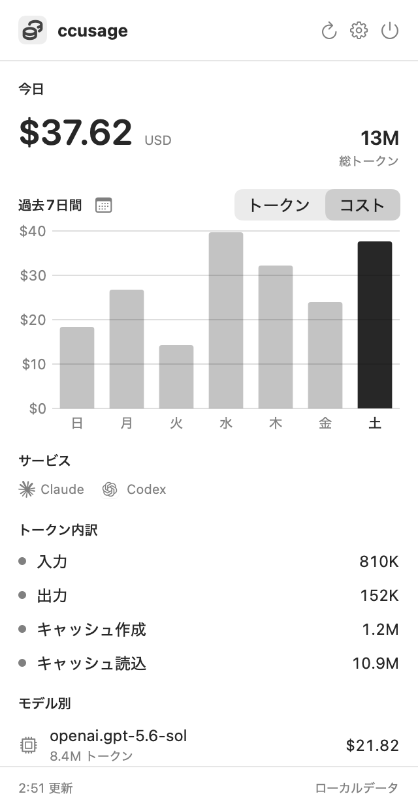

# CCUsageMenu

[English](README.md)

`ccusage` の利用状況を、Mac のメニューバーからすぐ確認できる軽量アプリです。
データはローカルの `ccusage` コマンドから取得し、外部サーバーへ送信しません。

<p align="center">
  
</p>

## 主な機能

- 今日のコストとトークン使用量
- 過去7日間のコスト／トークングラフ
- 日付を選択してサービス、トークン内訳、モデル別利用状況を確認
- 月間カレンダーから過去の利用状況を確認
- メニューバーに今日のコスト、トークン数、またはアイコンのみを表示
- 日本語／英語表示と更新間隔の設定
- Claude・Codex の利用サービス表示

## 必要環境

- macOS 14 Sonoma 以降
- [`ccusage`](https://github.com/ryoppippi/ccusage) コマンド

開発する場合は、追加で Xcode 16 以降と Swift 6 が必要です。

## インストール

1. [Releases](../../releases/latest) から最新の `CCUsageMenu-*.zip` をダウンロードします。
2. 展開した `CCUsageMenu.app` を `Applications` フォルダへ移動します。
3. 初回は Finder でアプリを右クリックし、**開く**を選択します。

GitHub Actions で作成する配布物は ad-hoc 署名です。Apple Developer ID による公証は行っていないため、初回起動時に macOS の確認が表示されます。

`ccusage` が未導入の場合は、先にグローバルインストールしてください。

```sh
npm install -g ccusage
```

## ソースから実行

```sh
git clone <repository-url>
cd ccusage_manu
swift run CCUsageMenu
```

Finder から起動できる `.app` を作る場合:

```sh
./Scripts/build-app.sh
open .build/CCUsageMenu.app
```

## テスト

```sh
swift test
```

サンプルデータを使って README のスクリーンショットを再生成できます。実際の利用データは読み込みません。

```sh
./Scripts/generate-screenshot.sh
```

## リリース

`v` から始まるタグを push すると、GitHub Actions がテスト、アプリのビルド、zip 化、SHA-256 チェックサムの作成を行い、GitHub Release を公開します。

```sh
git tag v0.1.0
git push origin v0.1.0
```

通常の push と pull request では、[CI workflow](.github/workflows/ci.yml) がテストとアプリバンドルの検証を行います。
