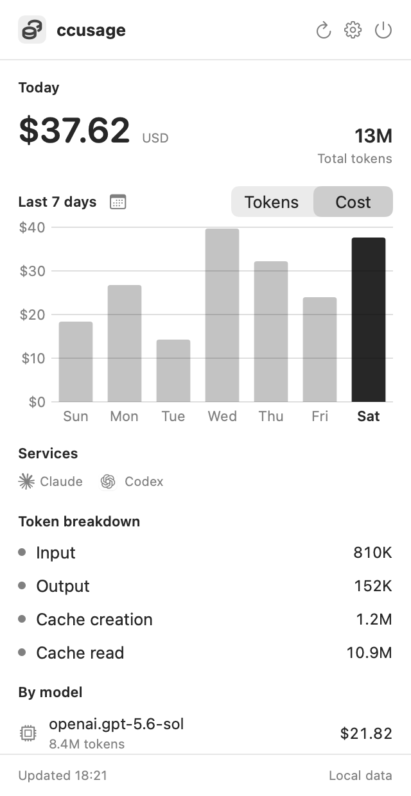

# CCUsageMenu

[日本語](README.ja.md)

A lightweight macOS menu bar app for checking your local [`ccusage`](https://github.com/ryoppippi/ccusage) usage at a glance. Your usage data is read locally from the `ccusage` command and is never sent to an external server.

<p align="center">
  
</p>

## Features

- Today's cost and token usage
- Seven-day cost or token chart
- Daily service, token breakdown, and model details
- Monthly calendar for reviewing historical usage
- Optional cost, token count, or icon-only menu bar display
- Configurable language and refresh interval
- Claude and Codex service indicators
- Japanese and English interfaces

## Requirements

- macOS 14 Sonoma or later
- The [`ccusage`](https://github.com/ryoppippi/ccusage) command

Development additionally requires Xcode 16 or later and Swift 6.

## Installation

1. Download the latest `CCUsageMenu-*.zip` from [Releases](../../releases/latest).
2. Extract it and move `CCUsageMenu.app` to your `Applications` folder.
3. On first launch, right-click the app in Finder and select **Open**.

GitHub Actions builds are ad-hoc signed and are not notarized with an Apple Developer ID, so macOS will show a confirmation on first launch.

Install `ccusage` globally if it is not already available:

```sh
npm install -g ccusage
```

## Run From Source

```sh
git clone <repository-url>
cd ccusage_manu
swift run CCUsageMenu
```

To create a Finder-launchable app bundle:

```sh
./Scripts/build-app.sh
open .build/CCUsageMenu.app
```

## Testing

```sh
swift test
```

The README screenshot can be regenerated with representative sample data. No real usage data is read.

```sh
./Scripts/generate-screenshot.sh
```

## Releasing

Pushing a tag beginning with `v` runs the tests, builds and packages the app, generates a SHA-256 checksum, and publishes a GitHub Release.

```sh
git tag v0.1.0
git push origin v0.1.0
```

For regular pushes and pull requests, the [CI workflow](.github/workflows/ci.yml) tests the package and verifies the app bundle.
